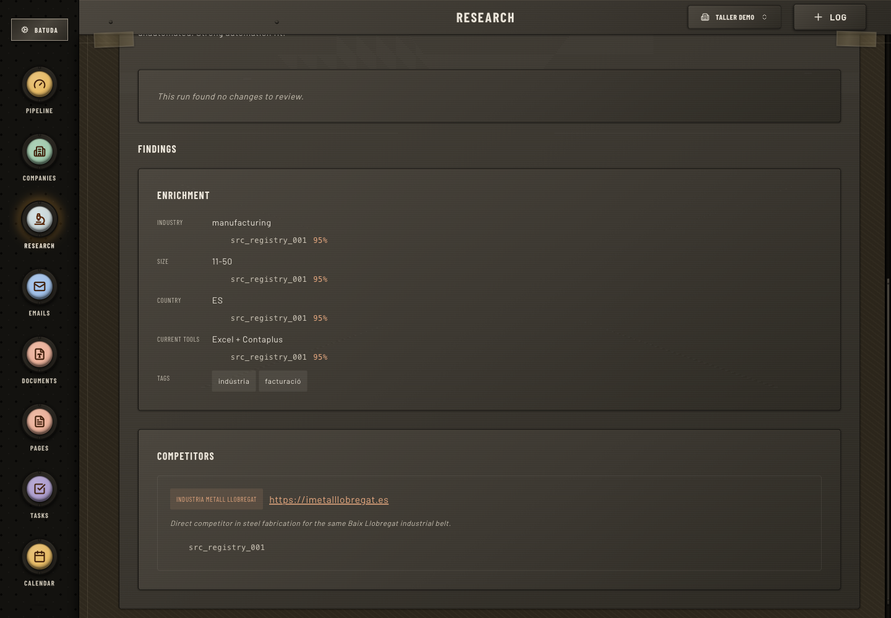
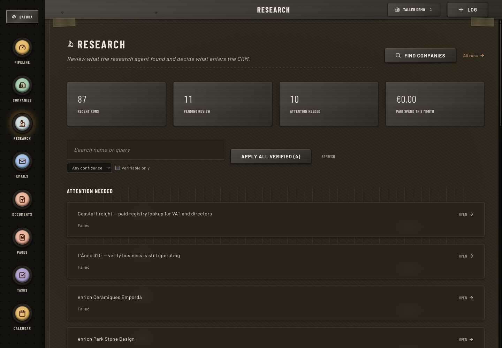
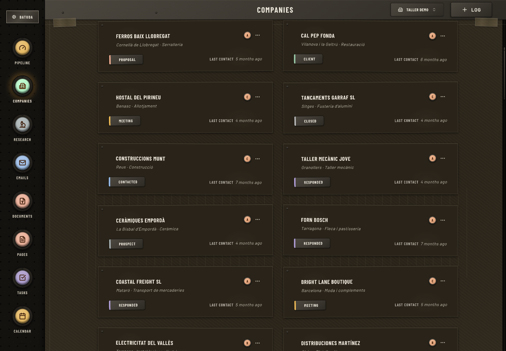
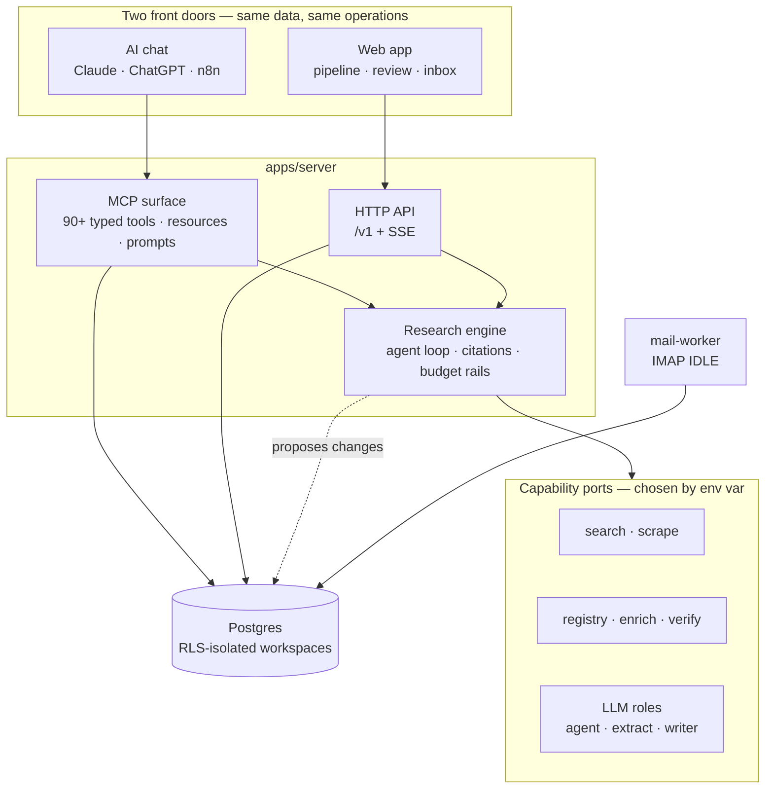

<div align="center">

# Batuda

**A research agent with a CRM around it.**

Point it at the open web. It comes back with findings that cite the page they came from, as structured records you can act on.
Work them from your AI chat or from the web app — the whole dataset is on MCP either way.

[](https://github.com/guillempuche/batuda/actions/workflows/ci.yml)
[](LICENSE)
[](#connect-your-ai-chat)
[](https://github.com/guillempuche/batuda/stargazers)

[Website](https://batuda.co) · [Getting started](docs/getting-started.md) · [Architecture](docs/architecture.md) · [Research design](docs/architecture.md#research)

</div>



## Why I built it

Most CRMs store the row and wait for you to fill it. I wanted the same tool to go *look the row up* — read a company's site, find the right person there, check it against a public registry — and hand me back something structured enough to act on, running on my own search and model keys, on a budget I set.

So the core of Batuda is a research engine. The CRM is what the findings land in, and there are two ways to work them: an AI chat over MCP, or the web app. Neither is the "real" interface — the same data and the same operations are on both.

## What makes it different

**Every claim carries a citation, or the run fails.** A finding has to resolve to a page the run actually reached. Pages it opened are archived so you can read the snapshot later. There is no "the model said so" tier.

**It tells you when it found nothing.** A run ends `succeeded`, `succeeded_low_confidence`, `no_reliable_data`, `failed`, or `cancelled`. An honest empty answer is a supported outcome, not a failure to paper over with a plausible guess.

**It proposes; you apply.** Research never writes a CRM row directly. Changes queue as proposals under optimistic concurrency, so a run can't silently overwrite an edit you made while it was working. You can set an auto-apply confidence threshold, and even then a value that came from a third party rather than the company itself always waits for a human.

**Your keys, your ceiling.** Per-run and per-month budgets per user, a monthly cap enforced under an advisory lock so parallel runs can't overshoot it, and anything paid above the threshold stops for approval. Caching at every layer — search, scrape, extract, LLM — so re-runs don't re-spend.

**Providers are roles, not vendors.** `search`, `scrape`, `registry`, `enrich`, `verify`, `report` are ports chosen by env var, each with a fallback chain and a zero-cost stub for local dev. The agent sees `registry_lookup`, never the vendor behind it.

## See it work

**Nothing enters the CRM until you say so.** Runs queue up for review, with what's ready to apply, what needs reading, and what went wrong kept apart.



**There's a real CRM underneath.** Company-first rather than deal-first, with status, priority, and when you last spoke.



## How it fits together



The research loop runs server-side on purpose. It needs a budget governor, provider selection and caching, a citation ledger, and bounded fan-out — none of which an external chat client can run. Everything else leans the other way: the MCP client you talk to does the reasoning and the writing, and Batuda is the data, tools, and authoring surface underneath it. [Full reasoning →](docs/architecture.md#intelligence-locus)

## The motion, end-to-end

1. **Find.** Start a run — free-text exploratory ("agroecology cooperatives frustrated with spreadsheets"), anchored to a company ("enrich this one"), or fanned out across a filter ("for each of these, find recent funding news"). It starts from the target's own site before anything a search engine offers, because a company is the best source on itself.
2. **Contact.** Email from your own inbox over any IMAP/SMTP provider — Infomaniak, Fastmail, M365, Gmail Workspace, Proton Bridge. Outbound goes from your address; inbound threads back onto the contact. Credentials are AES-256-GCM encrypted per inbox.
3. **Follow up.** Tasks and meetings carry the next step. Cal.com webhooks pull meeting state onto the contact.
4. **Remember.** An immutable interaction log captures every touch, and applied research keeps its trail — which page a value came from, which run read it, how sure it was, and what date it was true as of.

## Who it's for

The job — find someone, contact them, remember what happened — shows up in a lot of shapes. The ones I had in mind while building:

- A two-person agency tracking 80 local restaurants through proposals and follow-ups.
- A solo founder running a seed round across 120 angels and partners.
- A recruiter shortlisting candidates, or a journalist tracking sources for a long piece.
- A consultant juggling 12 live proposals across past and future clients.
- Anyone who'd rather not pay per seat for a CRM they mostly talk to through an AI chat.

One instance, many workspaces. Run it alone, run it for a team, or host several workspaces under one roof.

## Quick start

**Requires:** Node 24, pnpm 10, Docker + Docker Compose. If you use [Nix](https://nixos.org), `nix develop` pins Node and pnpm for you.

You do **not** need any provider keys to look around — every research capability has a zero-cost stub, and `pnpm cli seed` fills the workspace with sample data.

```bash
nix develop                 # or: install Node 24 + pnpm manually
pnpm install
pnpm cli setup              # copy .env files from .env.example
pnpm cli services up        # Postgres + MinIO via Docker
pnpm cli db migrate
pnpm cli auth bootstrap-org # create first admin + their org (interactive)
pnpm cli seed               # sample companies, contacts, research runs
pnpm cli doctor             # verify everything is healthy
pnpm dev                    # API + MCP server + web app
```

New here? The [detailed walkthrough](docs/getting-started.md) explains each step, which env vars matter, and what to do when one of them bites.

### Connect your AI chat

The MCP server speaks OAuth 2.1 over HTTP, so any MCP client can reach the same data the web app does.

```bash
claude mcp add --transport http batuda https://api.batuda.co/mcp
```

Self-hosting? Swap in your own server's `/mcp` URL. Claude, ChatGPT, and n8n all connect the same way.

### Self-hosting

Batuda needs Postgres and an S3-compatible bucket; everything else is in this repo. There's no packaged one-command deploy — you build and run the apps yourself. The pieces you'll want:

| What                                                    | Where                                                                                                         |
| ------------------------------------------------------- | ------------------------------------------------------------------------------------------------------------- |
| Every env var, annotated                                | [`.env.example`](.env.example)                                                                                |
| How env vars are named and resolved                     | [architecture.md](docs/architecture.md#environment-variables--secrets), [AGENTS.md](AGENTS.md#env-var-naming) |
| Postgres, MinIO, and GreenMail for local dev            | [`docker/docker-compose.yml`](docker/docker-compose.yml)                                                      |
| What runs where, and why                                | [architecture.md → Deployment](docs/architecture.md#deployment)                                               |
| How I actually deploy it (server, web app, mail-worker) | [`.github/workflows/deploy_*.yml`](.github/workflows)                                                         |
| Unikernel build config for the server and mail-worker   | [`apps/server/Kraftfile`](apps/server/Kraftfile), [`apps/mail-worker/Kraftfile`](apps/mail-worker/Kraftfile)  |
| Running it once it's up                                 | [runbooks.md](docs/runbooks.md), [observability.md](docs/observability.md)                                    |

I run the server on Unikraft and the web app on Cloudflare Workers, but nothing forces either — both are ordinary Node services.

## What's in it today

- **Research as the core capability.** Server-side agent loop with a mandatory citation ledger, a guard chain over extracted fields, gap rounds that keep searching for fields that came back empty, and live SSE progress. Five typed result schemas — `CompanyEnrichmentV1`, `CompetitorScanV1`, `ContactDiscoveryV1`, `ProspectScanV1`, `Freeform`. Wired today: Firecrawl (search + scrape), Brave (search), Hunter (enrich + verify), libreBORME (Spanish registry), Companies House (UK registry), and any OpenAI-compatible inference endpoint.
- **Quality you can measure.** A CLI eval scores the pipeline against a golden set of companies with known answers — grounding accuracy, field precision and recall, decision-maker recall, and the wrong-company rate that look-alike failures show up in. A change to extraction moves a number instead of a vibe.
- **Contact discovery.** Registry-first where a national registry exists (free and authoritative), paid enrichment elsewhere. Pattern-guessed addresses are gated through a free DNS MX check and only asserted when a verifier confirms them.
- **Email through your own inbox.** IMAP IDLE in a separate `mail-worker` process, SMTP out, footer injection, draft staging, and DSN bounce handling.
- **MCP-first agent surface.** 90+ intent-level typed tools, slug-completion resources, and guided prompts, behind OAuth 2.1 with per-key rate limiting.
- **Multi-tenant by construction.** Postgres RLS isolates workspaces, Better Auth handles identity, and one instance can host many organizations.
- **Multilingual page publishing** (Tiptap JSON blocks, `ca`/`es`/`en`) when a workspace wants a public landing page.

## Roadmap

Not dated, and ordered by what I actually hit friction on. Issues and PRs are the fastest way to move something up.

**Now** — research quality (a permanent line item; the eval harness is how I tell whether a change helped), contacts, sending email, MCP instruction templates, members with multiple roles, and multi-organization management.

**Later** — tasks and proposals. Both exist and are rough; treat them as work in progress rather than something to build on yet.

## How Batuda compares

| Project         | Web research                              | Open source | Provider choice     | Budget control            | First-party MCP    |
| --------------- | ----------------------------------------- | ----------- | ------------------- | ------------------------- | ------------------ |
| **Batuda**      | **Its own agent — cited, structured**     | **MIT**     | **Pluggable ports** | **Per-user policy + cap** | **Yes**            |
| Attio           | Workflow block on a record                | Closed      | Their stack         | AI credits                | Yes                |
| Folk            | "Research Assistant"                      | Closed      | Their stack         | Per-plan                  | Community wrappers |
| Twenty          | None as first-class (workflow `ai-agent`) | Custom OSS  | Vercel AI SDK       | None                      | Yes                |
| Atomic CRM      | None                                      | MIT         | n/a                 | n/a                       | OAuth + RLS proxy  |
| EspoCRM / Suite | None                                      | AGPL        | n/a                 | n/a                       | None               |

The combination I couldn't find anywhere else: **MIT + your provider keys + per-user budget caps + typed research schemas + intent-level MCP**. Full surface-by-surface comparison, including Lightfield and Reevo: [`docs/crm-competitor-analysis.md`](docs/crm-competitor-analysis.md).

## Tech stack

| Layer           | Technology                                          |
| --------------- | --------------------------------------------------- |
| Monorepo        | pnpm workspaces + Turborepo                         |
| Dev environment | Nix flake (Node 24 + pnpm + kraft)                  |
| Shared schema   | `packages/domain` — Effect Schema                   |
| Research engine | `packages/research` — Effect, pluggable ports       |
| CLI             | `apps/cli` — Effect CLI + @clack/prompts TUI        |
| Backend         | `apps/server` — Effect HTTP + MCP server            |
| Web app         | `apps/internal` — TanStack Start                    |
| Shared UI       | `packages/ui` — MD3 design tokens + BaseUI + Tiptap |
| Database        | Postgres (NeonDB)                                   |
| Deploy          | Unikraft via kraft CLI                              |
| Code quality    | Biome (lint + format) + dprint (markdown)           |

## Contributing

Contributions are welcome, and the ports architecture makes several of them small — a new search provider or company registry is one adapter against an interface that already exists.

[CONTRIBUTING.md](CONTRIBUTING.md) has where to start, the commit and test conventions, and what to run before opening a pull request.

## Documentation

**Run it**

- [Getting started](docs/getting-started.md) — first-run setup, auth bootstrap, troubleshooting.

**Understand it**

- [Architecture](docs/architecture.md) — system design, data flow, deployment.
- [Research](docs/architecture.md#research) — the agent loop, capability ports, citations, budget policy. Batuda's biggest feature, and the best place to start reading.
- [Backend](docs/backend.md) — Effect patterns, routes, MCP tools.
- [Frontend](docs/frontend.md) — design tokens, MD3, BaseUI, components.

**Strategic context**

- [CRM competitor analysis](docs/crm-competitor-analysis.md) — surface-by-surface comparison. Source for the table above.
- [Agency workforce platform](docs/agency-workforce-platform.md) — deferred design note on growing Batuda into a platform where AI and human workers share a queue.

**Operate it**

- [Observability](docs/observability.md) — logs, metrics, traces.
- [Runbooks](docs/runbooks.md) — operational procedures.

## License

[MIT](LICENSE)
